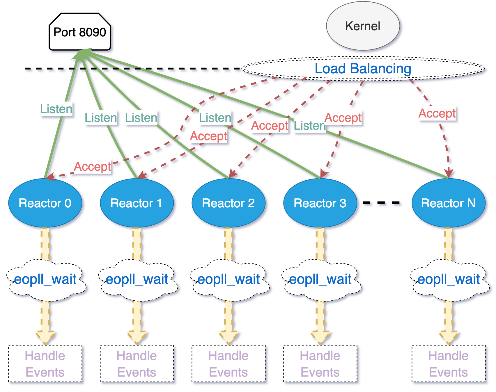

# LIBNET

## LIBNET 是采用 Reactor 模式的 C++ 多线程网络库

相关实现参考 [muduo](https://github.com/chenshuo/muduo)，详情如下：

- 采用 多 Reactors + 非阻塞IO + threadpool 的并发模型。

- 使用多线程充分利用多核 CPU，并使用固定线程数的线程池避免线程频繁创建销毁的开销。

- 多线程使用 `std::thread`, 不是直接使用/封装 POSIX API。

- 采用 one loop per thread 模式，每个线程维护自己的一个循环。

- 多路复用 I/O 仅支持 `epoll`, 不支持 `poll` 和 `select`。

- 同步互斥原语使用 C++ 标准库，不是直接使用/封装 POSIX API。

- 使用基于小根堆的定时器处理非活动连接，并且使用 `timerfd` 统一定时器事件源；

- 定时器的时间戳`TimeStamp`类基于 `std::chrono`封装而成, 而不是自己实现。

- 默认为 listen socket 开启 `SO_REUSEPORT` 选项：

  SO_REUSEPORT支持多个进程或者线程绑定到同一端口，提高服务器程序的性能，可以实现：

  - 允许多个套接字 `bind()`/`listen()` 同一个TCP/UDP端口
    - 每一个线程拥有自己的服务器套接字
    - 在服务器套接字上没有了锁的竞争
  - 内核层面实现负载均衡

  有了`SO_RESUEPORT`后，每个 进程/线程 可以自己创建`socket`、`bind`、`listen`、`accept`相同的地址和端口，各自是独立平等的。让 多进程/线程 监听同一个端口，各个进程中`accept socketfd`不一样，有新连接建立时，内核只会唤醒一个进程/线程来`accept`，并且**保证唤醒的均衡性。**

- 使用双缓冲技术实现了 C++ Stream 风格的异步日志系统

- 为减少内存泄露的可能，尽可能使用智能指针等 `RAII` 机制

## 并发模型


## Example

示例见 ./example

目前实现有：

- [Echo](https://github.com/BobbyWucj/libnet/tree/main/example/echo)
- [WebServer](https://github.com/BobbyWucj/libnet/tree/main/example/WebServer)
- ...

## Install

```bash
$ git clone git@github.com:BobbyWucj/libnet.git
$ cd libnet
$ ./build.sh [Debug/Release/clean]
```

## References

- [Muduo is a multithreaded C++ network library based on the reactor pattern.](https://github.com/chenshuo/muduo)